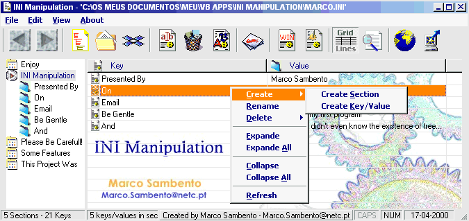



## INI Manipulation \(fixed and updated\)

### Description

This project shows/explains all routines

needed to manipulate sections/keys/values

within an ini file.

It has an intuitive interface, allowing

to drag keys between sections, create/delete

sections/keys/values, etc, but the routines

can also be used individually with other

projects.

A must have to whom works with INI Files.
 
### More Info
 

             |
---                |---
**Submitted On**   |2000-04-25 20:49:54
**By**             |[Marco Sambento](https://github.com/Planet-Source-Code/PSCIndex/blob/master/ByAuthor/marco-sambento.md)
**Level**          |Beginner
**User Rating**    |5.0 (15 globes from 3 users)
**Compatibility**  |VB 5\.0, VB 6\.0
**Category**       |[Files/ File Controls/ Input/ Output](https://github.com/Planet-Source-Code/PSCIndex/blob/master/ByCategory/files-file-controls-input-output__1-3.md)
**World**          |[Visual Basic](https://github.com/Planet-Source-Code/PSCIndex/blob/master/ByWorld/visual-basic.md)
**Archive File**   |[CODE\_UPLOAD52564272000\.zip](https://github.com/Planet-Source-Code/marco-sambento-ini-manipulation-fixed-and-updated__1-7367/archive/master.zip)

